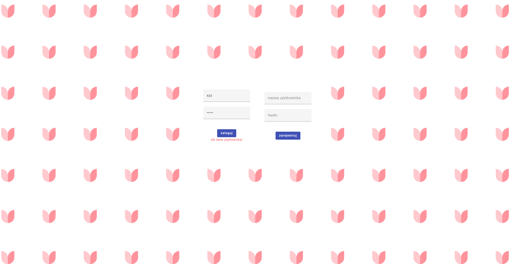
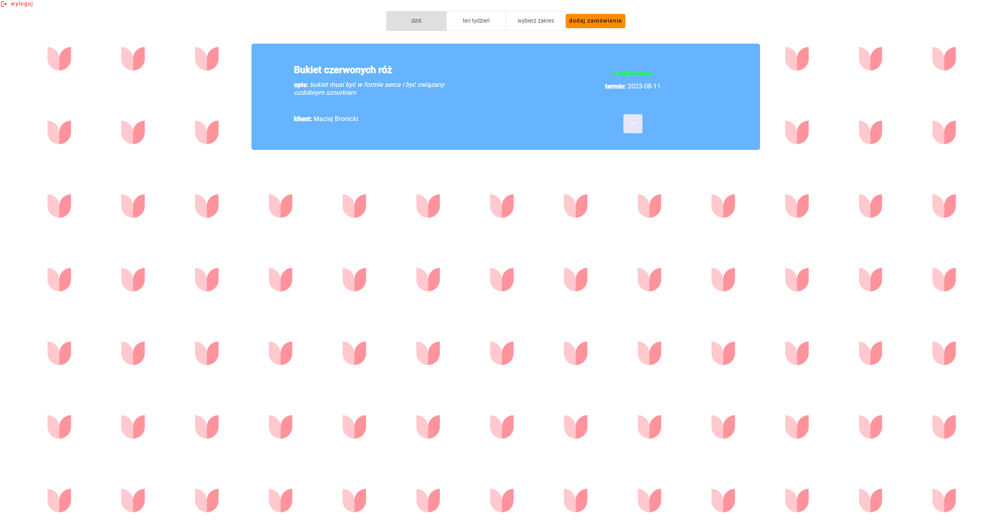
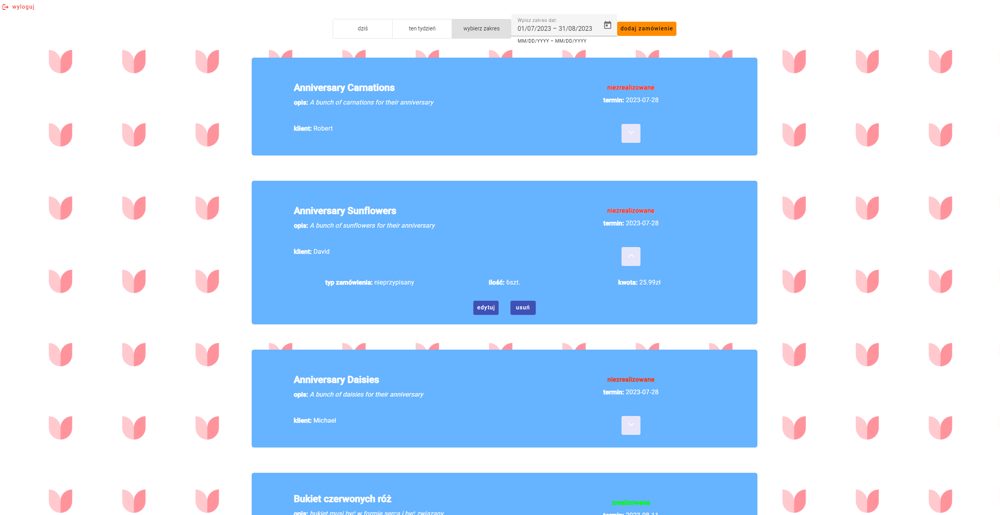
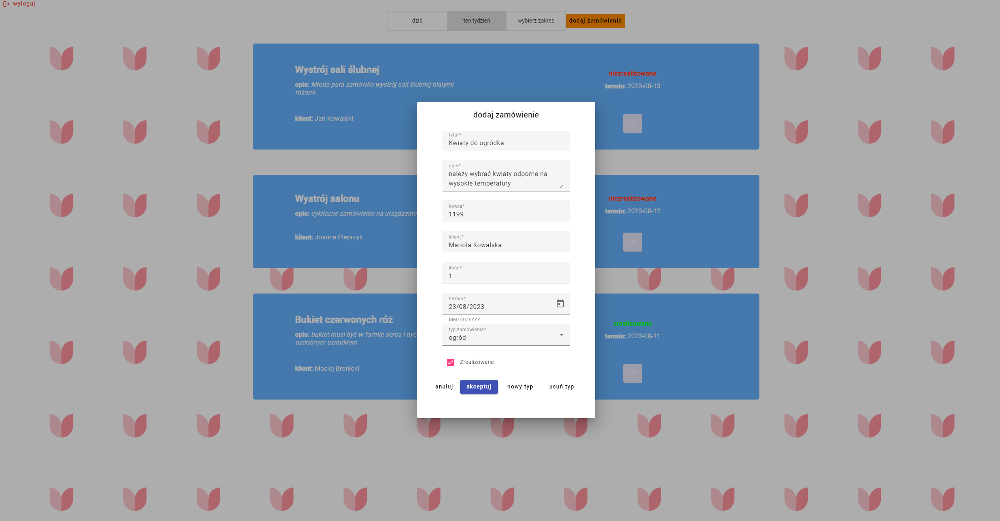
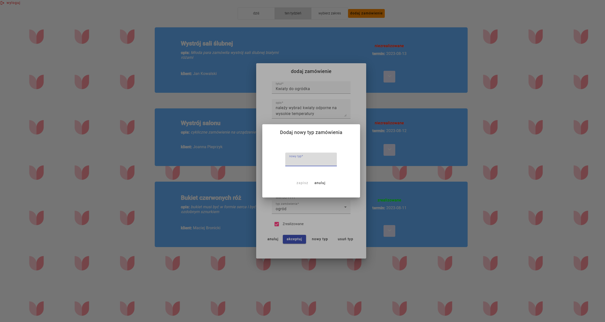

# OrdersAppFrontend

## Table of contents
* [General info](#general-info)
* [Technologies](#technologies)
* [Features](#features)
* [Usage](#usage)
* [Prerequisites](#prerequisites)
* [Setup](#setup)
* [Roadmap](#Roadmap)

## General info
This project is a management system for my friend's flower shop. It is designed to manage upcoming orders. 
	
## Technologies
The project is created with:
* angular/core: "15.2.0" 
* moment.js: "2.29.4" 
* rxjs: "7.8.0" 
* typescript: "4.9.4"  
* tailwindcss: "3.3.2" 
* ngx-cookie-service: "15.0.0"
* angular/material: "15.2.9" 
* Git: "2.39.1" 
## Features
- [x] Users
  - [x] Login
  - [x] Register
  - [x] JWT authentication
- [x] Displaying orders
  - [x] by current day
  - [x] by current week
  - [x] by custom day
  - [x] by custom range
- [x] Order management
  - [x] Add order
  - [x] Delete order
  - [x] Edit Order
- [x] Order type management
  - [x] Add order type
  - [x] Delete order type
- [x] Norifications 
## Usage 
 

 
 


## Prerequisites
 Make sure you have Node.js and npm (Node Package Manager) installed on your computer.<br>
You can download them from the official website: https://nodejs.org/
## Setup
1. Install Angular CLI:
```
npm install -g @angular/cli
```
2. Clone the Project:
```
git clone https://github.com/Krystian731/ordersAppFrontend

```
3. Navigate to Project Directory:
```
cd ordersAppFrontend

```
4. Install Dependencies:
```
npm install

```
5. Serve the Application:
```
ng serve

```
 Then navigate to `http://localhost:4200/`. The application will automatically reload if you change any of the source files.
 
 Note that the application will not work properly without running OrdersAppBackend.
 ## Roadmap
 * user will be greeted with more animations

   
